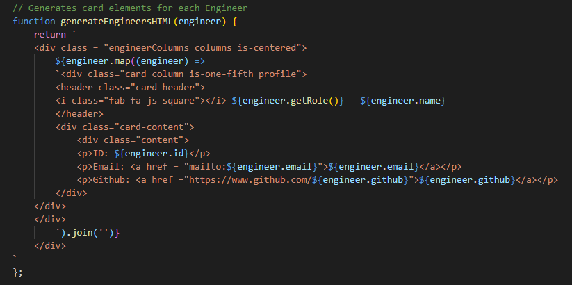

# Team Profile Generator ( CLI )

## Description

This app is designed for someone looking to quickly and easily generate an HTML page to display their team consisting of a manger, engineers and interns and their personal information.  This is a command line interface application that runs using Node.js.  This application utilizes the external node modules Inquirer and Jest for prompting the user for answers and testing the application respectively.  It also utilizes the native modules fs and util for writing to the HTML page asyncronously.

## Ideal User

```
This application is aimed at a user who has a team consisting
of a manager, engineers and interns and wants to display their 
information on an HTML page with minimal effort by just answering
a few simple questions and hitting run.
 
```

## Site Overview

<iframe src="https://drive.google.com/file/d/1LZOV-ecCj8-AxNepbPV8jxMx03kBZikh/preview" width="640" height="480"></iframe>

```
To introduce the application, the above video will run through the different modules
that were created to create classes for Employee, Manager, Engineer and Intern.  The
modules are tested using the node module Jest.  

The Employee module is the most basic class, and is used to create the other classes
by extending Employee and adding the unique traits that the user would want to display
on the HTML file.

Please watch the video if you are interested in running the tests for yourself, or want
to get a glimpse at how the classes were constructed using Javascript.  


```

<iframe src="https://drive.google.com/file/d/10d2epmXuZL5mgB5C5vZlAx-CM2zICzXL/preview" width="640" height="480"></iframe>


```
This video will give an overview of the app's code written in Javascript and overview how
to properly run the application in Node.js.  Once the programm is called in the terminal using
the 'node index.js' command, it will begin prompting the user for a series of questions starting
with the manager's information.

It will then ask whether the user wants to add an engineer or an intern, which they may do as many
times as they wish.  The loop will end when the user selected that they are done.  After that, the 
program will execute the function to generate an HTML page by appending various elements to a team.html
page.  

```



```

The engineer and intern loops use the javascript .map() feature of javascript to loop through however
many engineers or interns were entered into the inquirer prompt and will generate cards using the bulma
css framework into their respective divs that take up 1/5th of the container.  

The user can then use this generated team.html page to display their team proudly!  If you want to see
what the final product looks like, you can follow this link to the HTML page that was generated in the 
video demonstration and test for yourself that the links to the email and github pages are functional.  

```
[HTML PAGE](./team.html)


